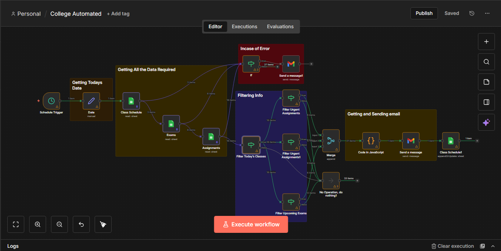

# 🎓 College Daily Management Automation (n8n)

An end-to-end **n8n automation system** that fully manages daily college-related tasks by generating a **daily email briefing** with classes, urgent assignments, upcoming exams, attendance warnings, and execution logs.

This system is designed to reduce manual tracking and ensure nothing important is missed during the academic day.

---

## 🚀 What This Automation Does

Every day at a scheduled time, the workflow:

- Fetches **today’s class schedule**
- Identifies **urgent assignments** (≤ 3 days left)
- Detects **upcoming exams** (≤ 7 days left)
- Flags **attendance risk** (below required percentage)
- Generates a clean **daily briefing email**
- Sends the email automatically via **Gmail**
- Logs the sent email into Google Sheets
- Sends alert emails if data or credentials fail

---

## 🧠 Problem It Solves

Students often miss:
- Assignment deadlines  
- Exam dates  
- Attendance shortages  

This automation acts as a **personal academic assistant**, ensuring full visibility and proactive alerts — without manual checking.

---

## 🛠 Tech Stack

- **n8n** (Workflow automation)
- **Google Sheets** (Data storage)
- **Gmail API** (Email delivery)
- **JavaScript (Code Node)** (Data formatting & logic)

---

## 📊 Data Sources (Google Sheets)

The workflow reads from the following sheets:

| Sheet Name        | Purpose |
|------------------|---------|
| Class_Schedule   | Daily classes & attendance |
| Assignments      | Assignment deadlines |
| Exams            | Exam schedules |
| Sended_Data      | Email logging & audit trail |

---

## 🧩 Workflow Overview

---

## ⚙️ Key Features

- Scheduled daily execution
- Multi-sheet data aggregation
- Conditional filtering logic
- Error-handling & alerts
- Email formatting using JavaScript
- Execution logging for reliability

---

## 📝 How to Use

1. Import the JSON workflow into **n8n**
2. Connect your Google Sheets credentials
3. Connect your Gmail account
4. Update email recipient
5. Activate the workflow

---

## 🔒 Notes

- Date calculations currently rely on sheet data
- Designed to be easily extensible with AI or calendar integrations

---

## 👤 Author

**Hassan Rizwan**  
n8n Automation Engineer  
